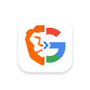

# 🔍 Brave to Google — Search Redirect Extension

<p align="center">
  
</p>

<p align="center">
  <strong>One click to search the same query on Google — right from Brave Search.</strong>
</p>

<p align="center">
  
  
  
</p>

---

## ✨ What It Does

Adds a **Google "G" logo button** to the right side of the search bar on [Brave Search](https://search.brave.com). Clicking it instantly opens **Google Search** with the exact same query — no copy-pasting needed.

### Before & After

| Without Extension | With Extension |
|---|---|
| `[Search Bar] [X] [🔍] [AI]` | `[Search Bar] [X] [🔍] [AI]` **`[G]`** |

---

## 🚀 Features

- 🎯 **One-click redirect** — Search the same query on Google instantly
- 🔄 **Persistent button** — Stays visible even when Brave's Svelte framework re-renders the page
- 🌙 **Dark mode support** — Adapts to both light and dark themes automatically
- 📱 **Responsive** — Works across different screen sizes and resolutions
- ⚡ **Lightweight** — No background scripts, no permissions, no tracking
- 🔗 **SPA-aware** — Updates automatically when you change queries or navigate tabs

---

## 📦 Installation

### From Source (Developer Mode)

1. **Clone** this repository:
   ```bash
   git clone https://github.com/YOUR_USERNAME/brave-to-google-ext.git
   ```

2. Open your Chromium-based browser and navigate to:
   ```
   chrome://extensions/
   ```
   > For Brave, use `brave://extensions/`

3. Enable **Developer mode** (toggle in the top-right corner)

4. Click **"Load unpacked"**

5. Select the cloned `brave-to-google-ext` folder

6. Visit [Brave Search](https://search.brave.com/search?q=hello+world) — the Google button should appear! 🎉

---

## 🗂️ Project Structure

```
brave-to-google-ext/
├── manifest.json      # Extension manifest (Manifest V3)
├── content.js         # Content script — injects the Google button
├── styles.css         # Button styling with dark mode support
├── icons/
│   ├── icon16.png     # Toolbar icon
│   ├── icon48.png     # Extensions page icon
│   └── icon128.png    # Chrome Web Store icon
└── README.md
```

---

## ⚙️ How It Works

1. The **content script** (`content.js`) runs on all `search.brave.com` pages
2. It extracts the search query from the URL parameter `?q=`
3. A Google "G" logo button is injected **to the right of the search bar**
4. A `MutationObserver` monitors the DOM — if Brave's Svelte framework re-renders and removes the button, it's **automatically re-injected**
5. Clicking the button navigates to `https://www.google.com/search?q=<your query>`

---

## 🔒 Privacy & Permissions

This extension requires **zero permissions**:

| Permission | Required? | Why |
|---|---|---|
| `activeTab` | ❌ No | Not needed |
| `storage` | ❌ No | Nothing stored |
| `cookies` | ❌ No | No cookies accessed |
| `host_permissions` | ❌ No | Uses content scripts only |

- ✅ No data is collected, stored, or transmitted
- ✅ No background service worker
- ✅ No external API calls
- ✅ Fully open source — audit the code yourself

---

## 🌐 Browser Compatibility

| Browser | Supported |
|---|---|
| Brave | ✅ |
| Google Chrome | ✅ |
| Microsoft Edge | ✅ |
| Opera | ✅ |
| Vivaldi | ✅ |
| Firefox | ❌ (uses Manifest V3 Chromium format) |

---

## 🤝 Contributing

Contributions are welcome! Feel free to:

1. Fork the repo
2. Create a feature branch (`git checkout -b feature/my-feature`)
3. Commit your changes (`git commit -m 'Add my feature'`)
4. Push to the branch (`git push origin feature/my-feature`)
5. Open a Pull Request

---

## 📄 License

This project is licensed under the [MIT License](LICENSE).

---

<p align="center">
  Made with ❤️ for people who use Brave Search but sometimes need Google
</p>
